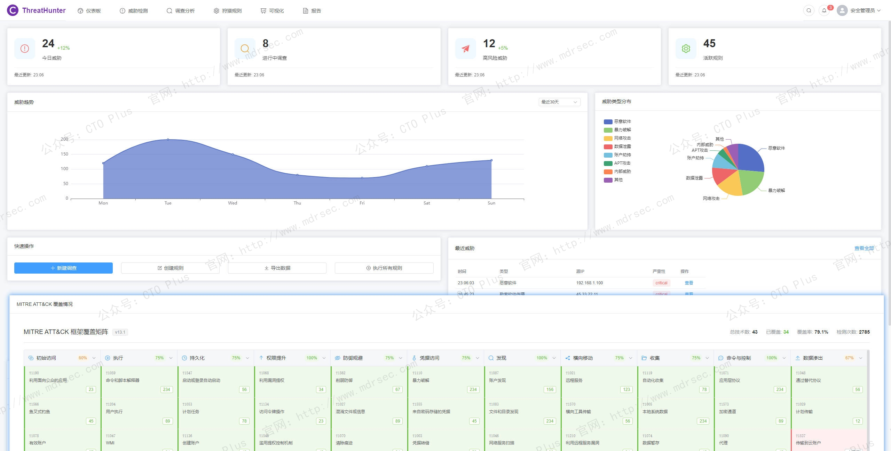
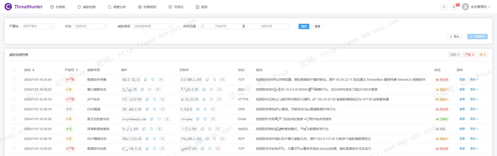
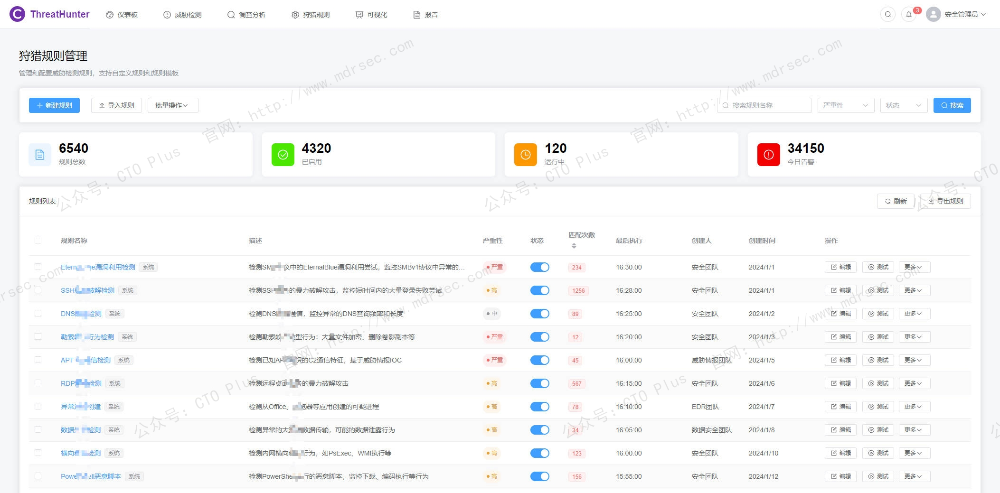

# 威胁狩猎系统（THS）

## 关于我们

- 官网： http://www.mdrsec.com

我们的技术文章和产品概述欢迎浏览我们的门户。

- 公众号：CTO Plus

最新的动态欢迎关注我们官方唯一公众号。

- 作者QQ

更详细更具体的需求，或者项目合作，或者问题 欢迎联系我。

- QQ群

我们官方组建的QQ群，如果您有兴趣也可以加入我们。

- 请喝咖啡

如果感兴趣，也可以请我喝杯咖啡

## 产品核心功能模块

## 为什么企业需要威胁狩猎系统

从被动告警到主动狩猎，高级持续性威胁（APT）、勒索软件即服务（RaaS）、以及基于“离地攻击”（Living-off-the-Land，LotL）手法的隐蔽入侵，已让传统的“边界防护+规则匹配”防御体系捉襟见肘。

传统安全设备如防火墙、IDS/IPS、传统蜜罐乃至SIEM，本质上是“守株待兔”——它们依赖已知特征码、静态规则或静态诱饵等待攻击者触发。然而，当前成熟攻击者普遍具备“反蜜罐侦测”能力，超过80%的APT团伙在初始侦察阶段即运行指纹识别脚本，一旦发现虚拟环境或异常交互特征便立即撤退。更棘手的是，攻击者大量利用PowerShell、WMI、Rundll32等系统原生工具进行横向移动，不留恶意文件痕迹，导致传统检测手段集体失明 。

面对这种攻防不对等的局面，威胁狩猎系统（Threat Hunting System，THS）应运而生，它标志着安全运营从 **“被动响应”向“主动猎杀”** 的范式跃迁。THS不再等待告警响起，而是基于假设驱动、AI赋能和行为分析，主动深入网络环境搜寻已绕过现有防御的潜伏威胁。

## 威胁狩猎系统的核心定义

威胁狩猎系统是一套集成大数据分析、机器学习、威胁情报与自动化溯源能力的主动防御平台。其核心理念是：**假设系统已被攻陷**，通过持续搜寻失陷信标（IOC）与攻击者行为痕迹（IOA），还原完整攻击链。

从技术演进看，威胁狩猎经历了三个关键阶段：

| 阶段 | 形态 | 核心特征 | 局限性 |
|------|------|----------|--------|
| 1.0 时代 | 传统蜜罐/诱捕系统 | 静态部署假资产、假服务，等待攻击者交互 | 指纹特征明显，易被APT团伙识别并绕过 |
| 2.0 时代 | 分布式诱捕网 | 大面积撒布假文件、假账号、假共享目录 | 诱饵静态化，攻击者可选择“不触碰”，潜伏期内无法发现 |
| 3.0 时代 | AI驱动主动狩猎 | 动态仿真、智能决策、攻击链逆向溯源 | 对算力和算法要求较高，需与现有安全设施深度联动 |

我们的THS系统：**从“等攻击者来”转变为“引攻击者来”** ——系统通过AI实时模拟真实业务环境与用户行为，主动诱使攻击者暴露其完整工具链与攻击意图 。

### 威胁狩猎系统的十大核心功能模块

我们的企业级THS具备以下十大核心功能，各模块之间需形成数据闭环与能力协同。

#### AI驱动的动态欺骗引擎

这是THS区别于传统蜜罐的核心能力。AI动态欺骗引擎具备以下子能力：

**（1）高保真环境仿真**
系统不再是静态的假服务器，而是基于真实业务资产画像，通过AI生成与生产环境高度一致的“数字孪生”蜜罐。例如：自动模拟运维人员的命令行历史记录、浏览器保存的域账号凭据、数据库连接字符串，甚至“不小心”遗留的明文密码本。这种深度伪装让攻击者难以分辨真伪，一旦尝到甜头便会持续深入交互 。

**（2）自适应人格化响应**
当攻击者进入诱捕环境后，AI会根据其操作习惯实时生成对应的“受害者人格”。例如：
- 攻击者偏好PowerShell？系统就在历史记录里“泄露”一条半截的Base64编码命令。
- 攻击者在搜寻RDP端口？系统立刻呈现一台防火墙策略松散的“弱鸡”Windows服务器。
- 攻击者尝试Mimikatz抓密码？系统故意将LSASS进程内存转储路径暴露无遗。

这种“你想要什么，我就演什么”的自适应能力，能将攻击者牢牢吸附在蜜罐中，榨取其完整的攻击行为数据 。

**（3）反指纹识别对抗**
针对攻击者的反蜜罐脚本，AI引擎动态调整响应时延、TCP/IP协议栈特征、系统uptime等底层指纹，使得自动化识别脚本失效。

#### 海量数据的高性能检索与查询引擎

威胁狩猎的本质是数据驱动的探索活动。安全分析师需要从TB甚至PB级的机器数据（终端日志、网络流量、身份认证、应用审计）中快速定位异常。

**（1）即席查询能力**
THS需支持类似HQL（Hunting Query Language）的交互式分析语言，允许分析师通过类SQL语法结合行为算子进行灵活查询。例如，搜索“过去7天内，非工作时间从财务服务器发起的所有DNS隧道连接” 。

**（2）存算分离与索引优化**
针对PB级数据规模，THS普遍采用存算分离架构：廉价磁盘存储历史数据，高配计算节点按需启动分析任务。同时，通过块索引（Block Index）技术，对ORC/Parquet列存文件构建Min/Max、Bloom Filter等轻量级索引，实现85%以上的文件裁剪率，将即席查询延迟从分钟级压缩至秒级 。

**（3）全文检索与倒排索引**
安全分析中大量使用`LIKE`模糊匹配和关键词搜索。THS需内置倒排索引引擎，支持对日志原文的快速全文检索，以便分析师直接“翻看”攻击者的原始操作痕迹。

#### 智能溯源与攻击链图谱构建

溯源是狩猎的核心产出环节。传统溯源依赖分析师手工拼接碎片化告警，耗时6-8小时是常态。AI驱动的智能溯源模块将这一过程自动化、可视化。

**（1）多智能体协作溯源**
系统将溯源任务拆解为多个子任务，由不同智能体分工执行：
- **入口溯源体**：从告警资产出发，反向检索其前置漏洞利用行为（如SQL注入、文件上传漏洞）。
- **横向移动体**：分析失陷主机对内网发起的扫描、凭证爆破、SMB/RDP连接行为。
- **持久化体**：检索计划任务、注册表Run键、服务创建等持久化痕迹 。

**（2）因果知识图谱**
THS将离散的告警、日志、资产信息映射为节点与边，构建攻击链图谱。图谱不仅呈现“A攻击了B”，更能标注攻击手法与ATT&CK框架的映射关系（如T1190漏洞利用、T1570横向移动），使攻击故事一目了然 。

**（3）断点自动补全**
当溯源因日志缺失或数据孤岛出现断点时，AI智能体会启动“多步进式狩猎循环”，自动关联DNS日志、进程行为数据补充缺失证据，直至还原完整攻击真相 。

#### 基于ATT&CK的行为分析引擎

ATT&CK框架已成为描述攻击者行为的通用语言。THS的行为分析引擎需具备：

**（1）TTPs映射能力**
系统将检测到的单点行为（如进程创建、注册表修改）自动映射到ATT&CK战术与技术ID，帮助分析师从“单条告警”视角升级到“攻击链阶段”视角。

**（2）行为基线偏离检测**
通过机器学习（如孤立森林、LSTM自编码器）学习用户与资产的日常行为基线，检测偏离行为。例如：一个常年只访问财务系统的账号突然连接外部GitHub下载脚本——即便该行为不匹配任何已知恶意特征，也会因偏离基线而被标记。

**（3）LotL手法专项检测**
针对攻击者对系统原生工具的滥用，THS内置专门的行为模型，识别PowerShell远程下载、WMI横向执行、CertUtil解码Payload等典型LotL行为模式 。

#### 威胁情报全自动拓线与验证

威胁狩猎发现的可疑IP、域名、文件哈希，需要情报平台的支撑来定性。

**（1）MCP驱动的自动化拓线**
通过模型上下文协议（MCP），将威胁狩猎能力封装为智能体服务，融入安全大模型。当发现一个可疑C2域名时，智能体自动执行：
- 调用WHOIS查询注册信息与历史解析记录
- 通过SSL证书指纹在互联网上搜寻同一证书关联的其他域名
- 在沙箱报告库中检索是否有样本曾连接该地址
- 最终生成包含C2通信拓扑、家族归属、关联样本的情报报告 

**（2）情报置信度交叉验证**
单一情报源可能存在误报或滞后。THS需聚合商业情报、开源情报、内部情报，通过交叉验证算法计算IOC的置信度，并标注“有效期”（TTL），确保分析师不会被过时或低质量情报误导 。

#### 基于大语言模型的自然语言狩猎助手

LLM的引入显著降低了威胁狩猎的操作门槛，使初级分析师也能执行高级任务。

**（1）自然语言转HQL**
分析师只需输入“帮我找找内网主机上有哪些机器在凌晨2点到5点之间对外发起过DNS请求”，LLM即可自动生成对应的HQL查询语句，并在后台执行查询 。

**（2）告警解读与报告生成**
传统模式下，一次完整溯源后还需花费1-2小时撰写分析报告。LLM可自动将攻击链图谱转化为结构化的文字叙事，包含攻击时间线、受影响资产、ATT&CK映射、处置建议等章节，并附上关键证据截图，直接交付运营团队执行处置 。

#### 实时流式检测与离线批处理双模引擎

威胁狩猎既需要应对实时产生的海量数据流，也需要在历史数据中进行长周期回溯。

**（1）流式检测引擎**
基于Flink或类似流计算框架，对Kafka中的实时日志进行CEP（复杂事件处理）模式匹配。例如，检测“30秒内同一IP访问超过5个不存在的敏感路径”这类扫描行为，实现秒级告警 。

**（2）离线批处理引擎**
当安全团队提出一个回溯假设（例如“怀疑过去半年内有攻击者利用Log4j漏洞入侵过”），系统启动Spark/Flink批作业，对存储在HDFS或S3上的历史数据进行全量扫描。

**（3）双引擎协同**
流式引擎的告警可作为离线引擎的触发器——当实时检测到可疑横向移动时，自动触发离线引擎回溯该主机的历史登录行为，形成“实时+回溯”的闭环分析。

#### 多源数据联邦与上下文富化

THS的价值高度依赖数据覆盖的广度与深度。

**（1）数据联邦能力**
THS不是要替代EDR、NDR、SIEM，而是作为上层“大脑”联邦查询各数据源。通过标准接口（JDBC、REST API、Kafka）连接：
- **终端数据**：进程创建、网络连接、文件变更（来自EDR/Sysmon）
- **网络数据**：NetFlow、PCAP、DNS日志（来自NDR/全流量设备）
- **身份数据**：AD域认证、VPN登录、SSO令牌（来自IAM/AD）
- **应用数据**：Web访问日志、数据库审计日志

**（2）上下文富化**
发现可疑IP后，系统自动从CMDB拉取相关资产信息（负责人、业务部门、操作系统版本），从漏洞扫描器获取该资产的漏洞状态，从情报平台获取IP的地理位置与历史恶意评分，将所有上下文聚合到统一分析视图。

#### 响应处置联动与自动化剧本

狩猎的终点不是一份报告，而是有效的风险消除。THS需具备与现有安全基础设施的联动能力：

**（1）与EDR/EPP联动**
当确认某主机已失陷，THS可调用EDR接口下发处置指令：隔离主机、终止恶意进程、删除持久化项、提取内存镜像。

**（2）与防火墙/零信任联动**
将已确认的恶意IP/域名通过API同步至防火墙动态黑名单，或通过零信任策略吊销相关会话令牌，阻断后续通信。

**（3）与SOAR剧本集成**
将威胁狩猎发现的特定场景（如“发现WebShell写入”）映射为SOAR剧本触发器，自动启动一系列响应动作：通知资产负责人、创建工单、触发漏洞扫描。

#### 狩猎假设管理与方法论沉淀

威胁狩猎不是随机探索，而应基于科学的假设驱动方法论。

**（1）假设库管理**
THS内置可定制的狩猎假设库，例如：
- “假设有攻击者正利用VPN漏洞绕过边界认证”
- “假设内网中存在针对域控的Kerberoasting攻击”
- “假设存在隐秘的DNS数据外传隧道”

每个假设关联一组特定的查询语句与检测逻辑。

**（2）狩猎成果知识化**
每次成功狩猎后，系统将攻击特征、查询语句、溯源路径沉淀为可复用的狩猎包。当类似攻击再次出现时，系统可自动触发相应狩猎流程，实现“一次分析，持续防护” 。

**（3）狩猎效能度量看板**
提供可视化仪表盘，量化狩猎运营成效：主动发现的威胁占比、狩猎假设命中率、平均狩猎周期、MTTD（平均发现时间）与MTTR（平均响应时间）趋势，使安全团队能够用数据证明狩猎投入的ROI 。

#### 其他

- 核心功能模块：资产管理、告警、事件、审计日志
- 威胁狩猎引擎：HQL查询语言、假设驱动狩猎、攻击图谱构建
- 欺骗防御系统：动态蜜罐、AI人格模拟、诱饵凭证/文件
- 威胁情报平台：IOC管理、情报源、自动富化
- 行为分析引擎：基线学习、异常检测、ATT&CK映射
- 响应处置系统：响应动作、自动化剧本、封禁列表

## 企业级THS的关键技术特性

- 分布式与弹性伸缩：THS需支持云原生部署，存算分离架构下计算节点可根据任务负载自动扩缩容。在HW行动等重保期间，可临时扩容计算资源应对激增的狩猎任务。
- 高保真环境隔离：动态蜜罐虽需与生产环境高度相似，但必须通过VLAN隔离、单向数据流控制、管理流量加密等手段严格隔离，防止攻击者从蜜罐横向跳入真实业务网。
- 隐私合规与数据脱敏：威胁狩猎涉及海量用户行为数据的分析，系统需内置数据脱敏引擎，对非必要的个人信息进行哈希化或掩码处理，满足GDPR、网络安全法等合规要求。
- 开放性与可扩展性：企业IT环境异构性强，THS需提供开放的API与插件框架，支持接入自定义数据源、自定义检测算法（如通过SPI插件扩展特定行业的检测模型），避免成为封闭的黑盒 。

## 五、结语：从“成本中心”到“作战指挥部”的蜕变

威胁狩猎系统的核心价值不在于部署了多少个蜜罐或产生了多少条告警，而在于它**重塑了企业安全运营的时序逻辑**——将防御的起点从事后追溯前移到事中对抗，将分析师的角色从“告警处理工”升级为“威胁猎手”。

一套成熟的企业级THS，应当是一个融合了**AI欺骗、大数据检索、图谱溯源、情报协同、LLM辅助**的智能作战平台。它不仅帮助企业在攻防对抗中发现那些已经“登堂入室”的隐匿威胁，更重要的是，它将每次应对高级攻击的实战经验转化为可复用的组织知识，推动安全能力持续进化。

在APT攻击手法日新月异的今天，部署威胁狩猎系统已不再是大企业的“可选项”，而是所有希望构建主动防御体系的企业必须面对的“必修课”。

## 产品清单

### 企业网络安全运营中心产品

- 资产安全配置管理系统（SCMDB）
- 终端侦测与响应系统（EDR）
- 网络侦测与响应系统（NDR）
- 企业网络资产攻击面管理系统（CAASM）
- 资产暴露面管理系统（AEMS）
- 网络安全蜜罐管理系统（HoneyPot）
- 安全事件收集与告警管理系统（SIEM）
- 扩展侦测与响应系统（XDR）
- 多引擎脆弱性扫描系统（VAS）
- 多源日志审计监测系统（LAS）
- 网络安全威胁情报中心（TIS）
- 网络安全漏洞库管理系统（VDBS）
- 网络安全编排与自动化响应（SOAR）
- 威胁狩猎系统（THS）
- 数据库安全审计系统（DSAS）
- AI智能体安全态势管理系统（AISPM）
- Web防火墙（WAF）
- 网站安全监测平台（WSM）
- 网络安全态势感知平台（SSAP）
- 网络安全自动化应急响应工具系统（NSRT）
- 企业网络安全运维工具系统（SecTools）
- 网络安全自动化等保测评系统（ASES）
- 浏览器安全监测防护系统（BSMPS）
- 网络安全用户实体行为分析系统（UEBA）
- 互联网电信诈骗预警防护系统（TPFWS）
- 云原生安全管理平台（CNAPP）
- 自动化渗透测试系统（PTS）
- 工业企业信息安全监测中心（IoT SOC）
- 企业智能安全运营中心（AISOC）

### 企业自动化运维产品

- 运维智能监控告警管理平台（AIMAMS）
- 企业网络工具系统（NTools）
- 自动化测试系统（AutoTest）
- 自动化运维系统（AutoOps）
- 企业运维工具系统（OpsTools）
- 物联网管理系统（IoTS）
- 软件开发生命周期管理系统（SDLC）
- IT流程管理系统（ITSM）

### 企业数字化运营资源管理系统产品

- 制造执行管理系统（MES）
- 运输管理系统（TMS）
- 跨境电商企业资源管理系统（ERP）
- 企业客户关系管理系统（CRM）
- 跨境电商仓库管理系统（WMS）
- 财务管理系统（FMS）
- 质量管理系统（QMS）
- 精准营销管理系统（PMS）
- 智能生产管理系统（SPMS）
- 电商BI系统（BI）
- 智能互联网分布式爬虫系统（AISpider）
